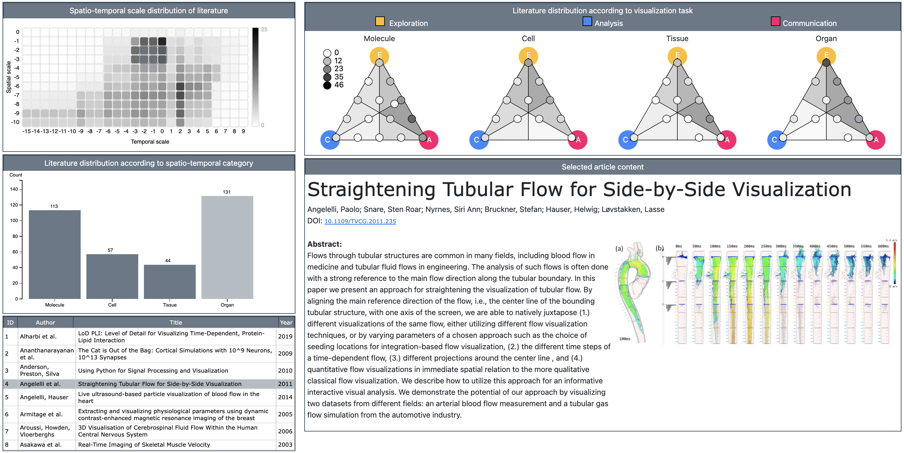

# Trends & Opportunities in Visualization for Physiology: A Multiscale Overview
## Supplementary Material



This paper has been accepted to EuroVis 2022 (STAR) and will be published in an upcoming issue of _Computer Graphics Forum_. **You can read the full paper [here](resource/Garrison_STAR_cameraready.pdf)**.

*Abstract*:
Combining elements of biology, chemistry, physics, and medicine, the science of human physiology is complex and multifaceted. In this report, we offer a broad and multiscale perspective on key developments and challenges in visualization for physiology. Our literature search process combined standard methods with a state-of-the-art visual analysis search tool to identify surveys and representative individual approaches for physiology. Our resulting taxonomy sorts literature on two levels. The first level categorizes literature according to organizational complexity and ranges from molecule to organ. A second level identifies any of three high-level visualization tasks within a given work: exploration, analysis, and communication. The findings of this report may be used by visualization researchers to understand the overarching trends, challenges, and opportunities in visualization for physiology and to provide a foundation for discussion and future research directions in this area. 

### Companion visualization tool
**Explore the literature** we have collected that provides a multiscale overview of visualization for physiology. This tool is a companion to our submitted paper.

You can either use the tool directly from here: [https://lauragarrison87.github.io/star.web/vis_tool](https://lauragarrison87.github.io/star.web/vis_tool) or **run locally**:
1. Clone or download repository.
2. Start a local server. We suggest using Node.js ```live-server```. If you don't have this installed already, do so with the following command: ```npm install live-server -g```
3. Navigate to the root directory of this repository, and run the following command: ```live-server```
4. This should launch a web browser. Click on the ```vis-tool``` directory icon. This should load the web tool.

The default database does not include related surveys. To load the database that includes related surveys:
1. In code editor of choice, open ```script.js```
2. In **line 1160**, change reference from ```"data/papers.csv"``` to ```"data/papers-w-surveys.csv"```

Related surveys are identified in the table view (bottom left) with an S as the first part of the ID.

### Additional supplementary material
- [Supplementary Tables 1 & 2](resource/supplementary_tables.pdf)
- [Literature Database (Excel file)](vis_tool/data/literature-database.xlsx)
