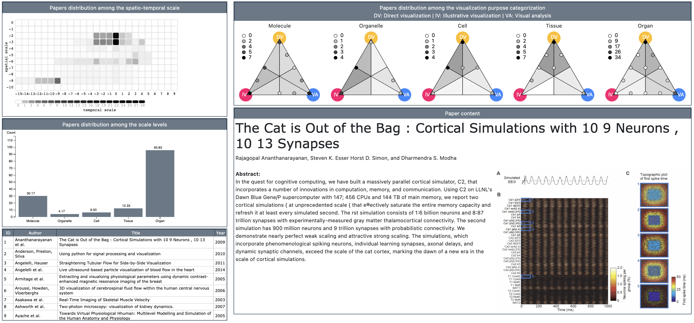

# Towards the Visualization of Physiological Processes: A State-of-the-Art Report
## Supplementary Materials

Explore the space of physiology visualization literature (current number: *155* articles), organized according to spatio-temporal scale and visualization approach, here: [https://lauragarrison87.github.io/star.web/](https://lauragarrison87.github.io/star.web/)

_Note: This is a work in progress!_ 

_Abstract_:
Physiology describes the fundamental science of life and its deepest workings. We see the underpinnings of human physiology cross-cutting all major scientific areas including medicine, biology, chemistry, and physics. With this state-of-the-art report we provide a broad overview and taxonomy of modern methods used for the visualization of physiological processes. We frame our taxonomy in two layers: the first layer organizes methods according to a spatiotemporal axis that is discretized by scale: molecule, organelle, cell, tissue, and organ scale. A subsequent layer further categorizes these methods according to the visualization approach that accommodates the task they serve: direct visualization, visual analysis and illustrative visualization. This categorization implicitly considers then whether the visualization depicts raw, derived, or abstracted data. Through this taxonomy one may quickly identify the extent (or absence) of visualization efforts to date at each scale for each of the three primary visualization techniques. We conclude our report with an outlook on promising new avenues of research in our efforts to visualize physiological processes.

### Additional materials 

- [Database of categorized literature to date (work in progress)](Physio_STAR_papers_10102021.xlsx)
- Short Biography of authors:
    - *Laura Garrison* is a PhD student in the Dept. of Informatics at the Univ. of Bergen, Norway. Her thesis centers on the visualization of physiological processes for communication, exploration, and analysis. She is a board-certified medical illustrator with extensive experience in the medical education technology start-up space as an illustrator, designer, and content director. 
    - *Ivan Kolesar* received his PhD from the Dept. of Informatics at the Univ. of Bergen, Norway, where his research interests include molecular visualization, the visualization of structural phenomena, and physiology visualization. He now is a software engineer for Rainfall AS, a technology company in Bergen. 
    - *Ivan Viola* is a professor in the Dept. of Computer, Electrical and Mathematical Science and Engineering of King Abdullah University of Science and Technology in Saudi Arabia and an associate professor in the Dept. of Computer Graphics at TU Wien, Austria. His research is focusing on effective visualization methods that are well understandable by humans, in the context of several application domains, notably computational biology.
    - *Helwig Hauser* is a professor in visualization at the Dept. of Informatics at the Univ. of Bergen, Norway with over 20 years of experience in researching and teaching visualization. He co-leads the VIDI (Visual Data Science for Large Scale Imaging Biomarker Discovery) project with Stefan Bruckner, and previous led a research project on the illustration of physiology (PhysioIllustration). He has extensive experience with writing state-of-the-art reports. 
    - *Stefan Bruckner* is a professor in visualization at the Dept. of Informatics at the Univ. of Bergen, Norway. His research interests include the visualization of biomedical data with respect to structural and functional aspects, in particular also using illustrative methods. He co-leads the VIDI project alongside Helwig Hauser.  
- Keywords for initial literature search criteria:
    - *Visual*: visualization, visual, visual abstraction
    - *Visualization task*: communicate, explore, analyze, present
    - *Scale/structure*: gene coexpression, gene interaction, molecular, molecule, structural biology, organelle, subcellular, cell, cellular, tissue, organ, heart, cardiac, brain, neurological, blood, multi-scale, multiscale
    - *Temporal/physiological*: dynamic(s), interaction(s), pathway, reactivity, process(es), life cycle, division, signal(ing), apoptosis, repair, contraction, activity, respiration, movement, connectivity, flow 