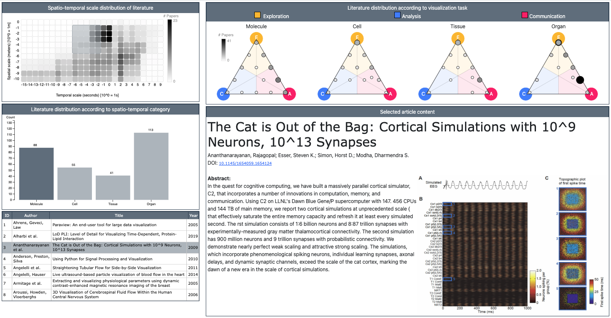

# Opportunities in Visualization for Physiology: A Multiscale Overview
## Supplementary Material

Explore the literature we have collected that provides a multiscale overview of visualization for physiology. Related surveys are included in the table, with an S as the first part of the ID._Note: This work is currently under submission_ 

_Abstract_:
Combining elements of biology, chemistry, physics, and medicine, the science of human physiology is complex and multifaced. In this report we offer a broad and multiscale perspective on key developments and challenges in visualization for physiology. Our literature search process combined standard methods with a state-of-the-art visual analysis search tool to identify surveys and representative individual approaches for physiology. Our resulting taxonomy sorts literature on two levels. The first level sorts literature according to organizational complexity, and ranges from molecule to organ. A second level identifies any of three high-level visualization tasks within a given work: exploration, analysis, and communication. The findings of this report may be used by visualization researchers to understand the overarching trends, challenges, and opportunities in visualization for physiology, and to provide a foundation for discussion and future research directions in this area.

- [Literature Database](vis_tool/data/literature-database.xlsx)
- Short Biography of authors:
    - *Laura Garrison* is a PhD student in the Dept. of Informatics at the Univ. of Bergen, Norway. Her thesis centers on the visualization of physiological processes for communication, exploration, and analysis. She is a board-certified medical illustrator with extensive experience in the medical education technology start-up space as an illustrator, designer, and content director. 
    - *Ivan Kolesar* received his PhD from the Dept. of Informatics at the Univ. of Bergen, Norway, where his research interests include molecular visualization, the visualization of structural phenomena, and physiology visualization. He now is a software engineer for Rainfall AS, a technology company in Bergen. 
    - *Ivan Viola* is a professor in the Dept. of Computer, Electrical and Mathematical Science and Engineering of King Abdullah University of Science and Technology in Saudi Arabia and an associate professor in the Dept. of Computer Graphics at TU Wien, Austria. His research is focusing on effective visualization methods that are well understandable by humans, in the context of several application domains, notably computational biology.
    - *Helwig Hauser* is a professor in visualization at the Dept. of Informatics at the Univ. of Bergen, Norway with over 20 years of experience in researching and teaching visualization. He co-leads the VIDI (Visual Data Science for Large Scale Imaging Biomarker Discovery) project with Stefan Bruckner, and previous led a research project on the illustration of physiology (PhysioIllustration). He has extensive experience with writing state-of-the-art reports. 
    - *Stefan Bruckner* is a professor in visualization at the Dept. of Informatics at the Univ. of Bergen, Norway. His research interests include the visualization of biomedical data with respect to structural and functional aspects, in particular also using illustrative methods. He co-leads the VIDI project alongside Helwig Hauser.  
